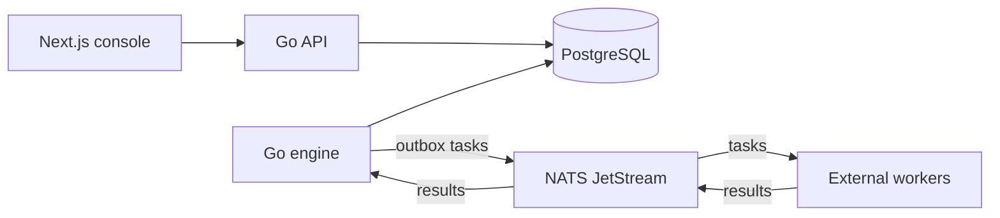

# FlowForge

FlowForge is an open-source durable workflow orchestration engine for coordinating distributed services and long-running processes.

A normal function call works until the process spans several services, takes
minutes, needs retries, or crashes halfway through execution. FlowForge records
the process state in PostgreSQL and dispatches each step to a worker, so a process
restart does not lose the execution's progress.

The first release runs sequential workflows with simulated workers. It is a
working foundation for a broader orchestration engine, with a deliberately small
execution model. It is not yet a production service or a replacement for Temporal.

## Architecture



The control plane is a modular Go codebase with separate API, engine, and worker
processes. Workflow definitions and execution state have independent domain
modules. HTTP, PostgreSQL, and NATS are adapters around those rules. PostgreSQL
is the source of truth; JetStream transports work and results.

An execution transition, its history entries, and the next task's outbox row
commit together. The outbox relay waits for a JetStream publish acknowledgement
before marking a message published. Result processing deduplicates by task ID
and checks the current attempt and deadline. This is at-least-once delivery with
idempotent state changes. Workers must also make external business effects
idempotent; broker deduplication alone cannot do that.

See [architecture](docs/architecture/overview.md),
[consistency and recovery](docs/architecture/consistency.md), and
[the initial scope](docs/architecture/initial-scope.md).

## Quick start

Install Docker with Compose v2 and Python 3 for the demo script:

```bash
git clone https://github.com/ricardoverita/flowforge.git
cd flowforge
docker compose up --build -d --wait
./scripts/demo.sh
```

Compose generates development database and broker credentials into a private
Docker volume on first startup. An `.env` file is optional; [`.env.example`](.env.example)
documents the available overrides. Volumes preserve executions and broker data
when containers restart.

The API is at [localhost:8080](http://localhost:8080/health), with an
[API explorer](http://localhost:8080/docs) and
[OpenAPI specification](http://localhost:8080/openapi.yaml).

```bash
docker compose --profile ui up --build -d --wait
```

The console opens at [localhost:3000](http://localhost:3000). It can register
workflow versions, start executions, and inspect step state and execution
history. Execution lookup currently requires an ID.

The API has optional bearer authentication through `API_TOKEN`. Compose binds
published ports to loopback and leaves API authentication disabled by default.
Keep this development environment private. The console has no user login; see
[the security boundary](docs/architecture/security.md) before exposing it.

## Example workflow

```text
customer-onboarding v1

verify_identity → risk_check → create_account → send_notification
```

The example worker implements `identity.verify`, `risk.check`, `account.create`,
and `notification.send` as deterministic simulations. Each step receives the
previous step's output. The demo verifies execution creation, durable progress,
request idempotency, and history lookup through the API.

See [the fintech example](examples/fintech-onboarding) for request payloads and
controlled failure experiments. For example:

```bash
WORKER_FAIL_TASK=risk.check WORKER_FAIL_ATTEMPTS=1 \
  docker compose up -d --force-recreate example-worker
./scripts/demo.sh
```

## Current capabilities

- Immutable, versioned workflow definitions and sequential executions.
- Domain-controlled execution and step transitions, with durable history.
- Bounded attempts, persisted retry times, exponential backoff with jitter, and timeout recovery.
- API execution idempotency, transactional outbox publication, result inbox deduplication, and stale-attempt fencing.
- REST API, OpenAPI explorer, development console, structured logs, metrics, and distributed trace propagation.
- Containerized development, CI, and an AWS Terraform reference foundation.

`waiting` and `cancelled` exist in the domain lifecycle, but external event
waiting and cancellation APIs are not implemented. The worker is an example,
not an integration framework for arbitrary business services.

## Development and testing

Backend development uses Go 1.27. Frontend development uses Node.js 24.

```bash
make build
make test
make test-race
make vet
make tools
make lint
make security
```

`make test` writes `coverage.out`. Unit tests cover domain invariants, HTTP
behavior, configuration, worker simulation, and error mapping. Integration tests
exercise real PostgreSQL and NATS instances, including message duplication,
concurrent scheduling, retries, and recovery. Run them against an isolated test
environment as described in [testing](docs/testing.md); never point them at a
shared database.

```bash
cd web
npm ci
npm run lint
npm run typecheck
npm test
npm run build
```

The repository's GitHub Actions workflows verify backend and frontend checks,
integration behavior, Docker builds, dependency vulnerabilities, and Terraform
formatting and validation. See [contributing](CONTRIBUTING.md) for the workflow.

## Observability

```bash
make observability
docker compose logs -f flowforge-api flowforge-engine example-worker
```

Prometheus opens at [localhost:9090](http://localhost:9090) and Grafana at
[localhost:3001](http://localhost:3001). Grafana credentials are generated locally;
see [observability](docs/observability.md) for the login command, metrics, and
trace export configuration. The collector prints received traces; no trace
storage backend is included yet.

## Infrastructure

Docker Compose is the local runtime. The cloud reference uses ECS Fargate, RDS
PostgreSQL, ECR, Secrets Manager, and CloudWatch. Persistent NATS hosting remains
an explicit infrastructure prerequisite. The Terraform foundation does not
provision a production NATS cluster or apply changes automatically.

See [the Terraform deployment guide](deployments/terraform/README.md) and
[the deployment strategy](docs/deployment.md). CD is opt-in and uses GitHub OIDC
instead of permanent AWS access keys. No AWS deployment runs by default.

## Roadmap

1. A real worker integration contract and retention policies for executions, inbox, outbox, and history.
2. Cancellation, durable timers, and external event waiting.
3. Conditional and parallel steps with explicit join semantics.
4. Compensation and human approval workflows.
5. Measured load tests, stronger deployment controls, and authenticated operator access.

AI workflows use the same orchestration model, but no AI agents or model
integrations are included in this release. See [the load-test plan](docs/performance.md).

## Architecture decisions

[ADRs](docs/adr) record the choices around Go, PostgreSQL, JetStream, the monorepo,
local containers, ECS, message delivery, outbox transactions, concurrency, and
security boundaries. They describe the implemented tradeoffs and the limits of
this release.

## Contributing and license

Read [CONTRIBUTING.md](CONTRIBUTING.md) before proposing changes. Report security
issues privately through the process in [SECURITY.md](SECURITY.md).

FlowForge is licensed under [Apache License 2.0](LICENSE).
