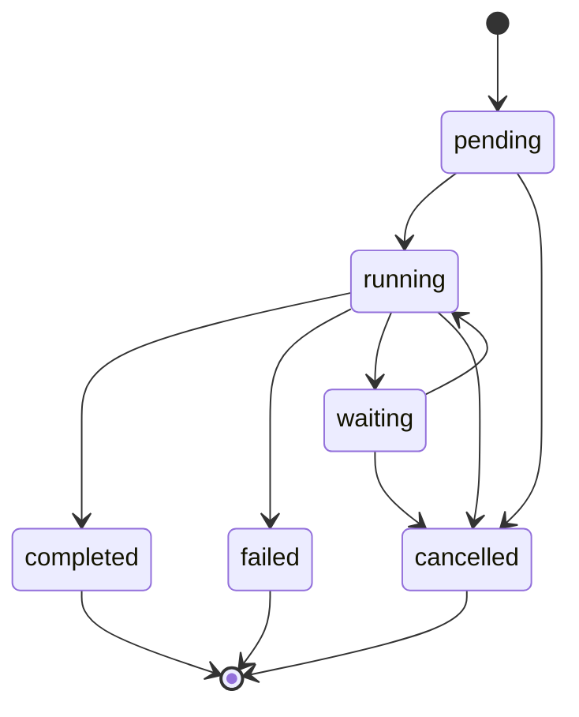

# Architecture

FlowForge has one Go module and three long-running processes. Shared domain and
adapter packages make the deployment boundaries explicit without creating
independent internal microservices. PostgreSQL owns durable state. NATS owns
message transport. The web console is a server-rendered client of the REST API.

## Modules

| Module | Responsibility |
| --- | --- |
| `internal/workflow` | Definition validation, ordered steps, versions, attempt and timeout policy |
| `internal/execution` | Execution aggregate, step lifecycle, sequential invariants, snapshots |
| `internal/api` | Application commands, transport DTOs, HTTP validation and error mapping |
| `internal/postgres` | Explicit SQL, migrations, execution transactions, inbox and outbox |
| `internal/engine` | Scheduling due work, outbox relay, and consuming worker results |
| `internal/messaging` | Task/result protocol, JetStream streams, consumers, tracing headers |
| `internal/worker` | Deterministic fintech simulation and worker acknowledgement behavior |
| `internal/platform` | Validated configuration, process lifecycle, readiness, shutdown |
| `internal/telemetry` | OpenTelemetry initialization and operational instruments |
| `internal/fault` | Error classification across domain, application, and adapters |

Workflow definition and execution are the initial domain capabilities. Worker
integration is an external boundary, not a separate business domain. Scheduling
and result application share the execution transaction. Cross-cutting packages
remain internal because there is no stable public Go SDK contract yet.

The API uses a store port to isolate application operations from PostgreSQL.
The engine's transaction-heavy adapter is explicit rather than hidden behind a
generic repository or Unit of Work framework. Constructor wiring in the commands
provides dependency injection without a container.

## Processes

- **API:** validates and records immutable definitions and executions; reads state and history. It does not execute business tasks.
- **Engine:** starts pending executions, schedules due steps, detects expired attempts, persists results, and publishes the outbox.
- **Worker:** pulls tasks, performs an external action, publishes a result, and then acknowledges the task. The bundled worker only simulates actions.
- **Migration runner:** applies SQL migrations under a database migration lock before application startup.

## Domain model

A workflow version has its own UUID and a unique `(name, version)` pair. Step
definitions receive UUIDs from the API and preserve array order. An execution
references one immutable definition version and snapshots its step policies.
Times are stored in UTC. Inputs and outputs use PostgreSQL `json` to preserve
bounded payload bytes and number tokens; the engine does not query inside them.
Statuses, versions,
attempts, identifiers, ordering, and timestamps have relational columns and
database constraints.

The execution aggregate keeps mutable state private. A snapshot is a detached
copy for persistence or serialization. Restoring a snapshot validates lifecycle,
step order, attempts, timestamps, and terminal-state invariants. SQL constraints
provide another line of defense; adapter transactions still call domain methods.

The runtime currently drives `pending`, `running`, `completed`, and `failed`.
`waiting` and `cancelled` have validated domain transitions but no public
commands yet. A transient step failure uses `retry_wait` while the workflow
remains `running`; this is distinct from waiting for an external event.

A successful step supplies the next step's input. Timeout or a transient result
can schedule a retry until `max_attempts` is exhausted. A permanent failure ends
the workflow immediately. The engine cannot stop an already running external
operation; fencing only prevents a late result from changing durable state.
